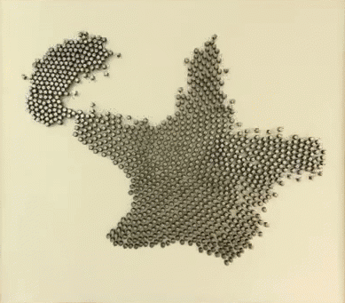
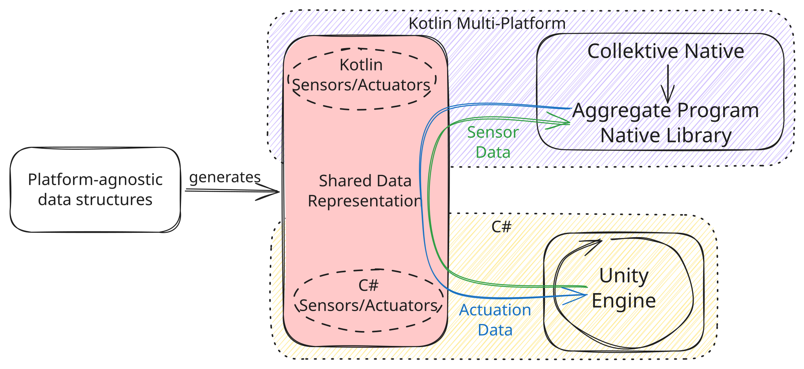

+++
title = "High-Fidelity Simulation of Aggregate Computing Systems with Collektivity"
outputs = ["Reveal"]
+++

## High-Fidelity Simulation of Aggregate Computing Systems
## with Collektivity

<br />

*Filippo Gurioli*, __*Martina Baiardi*__, *Angela Cortecchia*, and *Danilo Pianini*
<br />
<br /><small>
Department of Computer Science and Engineering <br/>
University of Bologna, Cesena, Italy
</small>

---

{}
{}

## Context: Collective Adaptive Systems

* Collective Adaptive Systems are made of many *situated* and *interacting* devices.

* Their behaviour emerges from *local interactions* under mobility, failures, and changing environments.

* Examples include robot swarms, sensor networks, and IoT applications.

{}
{}

<br />

{}
{}

---

{}
{}

## CAS Programming Frameworks

*Aggregate Programming* lets developers express *collective behaviour* instead of orchestrating every device.

* The same program runs repeatedly on each device.
* Devices exchange messages with neighbours.
* The state is represented as a *computational field*, which maps devices (and time) to a value.

Examples: *Collektive*, *Scafi*, *Protelis*, *FCCP*.

{}
{}

<br />

{}
{}

--- 

## Validation of CAS

Simulation is a widely used approach for validating *Collective Adaptive Systems*, which faces a persistent trade-off:


<br/>
<br/>

{}
{}

<div style="border:1px solid #cfeedd; background:#f7fff7; padding:0.8em; border-radius:8px; margin-right:0.6em; text-align:left">

### Lower fidelity Simulation

* <span style="color:#73ab84">Scales easily to large populations</span>
* <span style="color:#73ab84">Supports collective adaptive systems execution</span>
* <span style="color:#e63b2e">Simplifies physics and environment — reduced realism</span>

</div>

{}
{}

<div style="border:1px solid #cfeedd; background:#f7fff7; padding:0.8em; border-radius:8px; margin-left:0.6em; text-align:left">

### Higher fidelity simulation

* <span style="color:#73ab84">More realistic physics</span>
* <span style="color:#73ab84">Richer environments</span>
* <span style="color:#e63b2e">No support for collective adaptive systems execution</span>

</div>

{}
{}

---

{}
{}

## Game Engines

A promising direction to break this trade-off is to leverage *game engines* as high-fidelity simulation platforms for Collective Adaptive Systems.

Game engines already provide capabilities that CAS simulators often need:

* real-time 3D rendering
* physics and collisions
* interactive scene authoring
* complex environments
* support for mixed reality and digital twins

Examples: *Unity*, *Unreal Engine*, *CryEngine*

{}
{}


<div style="border:1px solid #cfeedd; background:#f7fff7; padding:0.8em; border-radius:8px; margin-bottom:0.6em; text-align:left">

### The open question: 
can we run aggregate programs *inside* such an environment, not just visualize traces?

</div>

{}
{}

---

## Requirements

<div style="border:1px solid #cfeedd; background:#f7fff7; padding:0.8em; border-radius:8px; margin-bottom:0.6em; text-align:left">

1. *Agnosticism to the case study*
    
    the integration should not be tailored towards any specific CAS case study.

</div>

<div style="border:1px solid #cfeedd; background:#f7fff7; padding:0.8em; border-radius:8px; margin-bottom:0.6em; text-align:left">

2. *Bidirectional Communication*

    the engine must provide the aggregate program with the necessary sensory data, while the aggregate program must send actuation commands back to the engine to drive the evolution of the simulation.

</div>

<div style="border:1px solid #cfeedd; background:#f7fff7; padding:0.8em; border-radius:8px; margin-bottom:0.6em; text-align:left">

3. *High-Performance*

    adding realism will inevitably impact on scalability, the system should be capable to scale to the order of hundreds of deployed devices.

</div>

---

## Proposal: Collektivity

Collektivity integrates *Collektive* with the *Unity* game engine.

<br/>


{}
{}

<div style="border:1px solid #cfeedd; background:#f7fff7; padding:0.8em; border-radius:8px; margin-right:0.6em; text-align:left">

### Unity

* owns the world
* computes physics
* maintains neighbourhoods
* returns perceptions from the environment
* written in *C#*
* supports external plugins and custom entity definitions

</div>

{}
{}

<div style="border:1px solid #cfeedd; background:#f7fff7; padding:0.8em; border-radius:8px; margin-left:0.6em; text-align:left">

### Collektive

* computes collective behaviour
* stores device state
* returns actuations commands to execute
* written in *Kotlin Multiplatform*
* supports native compilation and it can be easily integrated with different runtimes

<br/>

</div>

{}
{}

---

## Design



---

## Architecture


---

{}
{}

## Shared Data Model

Collektivity uses *Protocol Buffers* to define the data exchanged across Unity and Collektive.

* one schema
* generated *C#* bindings for Unity
* generated *Kotlin* bindings for Collektive
* explicit `Sensors` and `Actuators` messages

{}
{}

<div style="font-size: 50px !important;">

```protobuf
message Actuators {
  Vector3 targetPosition = 1;
}

message Sensors {
  double sourceIntensity = 1;
  Vector3 currentPosition = 2;
  repeated Vector3 obstacles = 3;
}
```

</div>

{}
{}

---

{}
{}

## Interoperation Challenge

Unity and Collektive do not share the same runtime:

* Unity runs on a custom .NET environment.
* Collektive is Kotlin Multiplatform.
* Existing Collektive targets cannot simply run inside Unity.


{}
{}


Two approaches were compared:

<div style="border:1px solid #cfeedd; background:#f7fff7; padding:0.8em; border-radius:8px; margin-bottom:0.6em; text-align:left">

1. Socket-based inter-process communication.

</div>

<div style="border:1px solid #cfeedd; background:#f7fff7; padding:0.8em; border-radius:8px; margin-top:0.6em; text-align:left">

2. Native library invocation through FFI.

</div>

{}
{}

---

{}
{}

## Comparison

### Socket backend

* Unity and Collektive run as separate processes.
* Data crosses TCP sockets.
* More flexible, but expensive.


### Native backend

* Collektive is compiled as a native shared library.
* Unity invokes it through FFI.
* Much faster, so it was selected.

{}
{}

| Metric | Socket-based IPC | Native library with FFI | *Speedup* |
| --- | --- | --- | --- |
| Median | 200 ms | 550 µs | *363x* |
| Mean | 200 ms | 484 µs | *456x* |
| p95 | 200 ms | 612 µs | *719x* |
| p99 | 202 ms | 850 µs | *747x* |

{}
{}

---

{}
{}

## Native Execution Through FFI

The socket-based approach was over 450x slower than the native library approach, with a peak of over 700x.

Collektive is compiled as a *native library* and invoked from Unity through *FFI*.

{}
{}

<div style="font-size: 50px !important;">


```kotlin
interface Engine {
  fun step(id: Int, sensorData: Sensors): Actuators
  fun subscribe(node1: Int, node2: Int): Boolean
  fun unsubscribe(node1: Int, node2: Int): Boolean
  fun addNode(id: Int): Boolean
  fun removeNode(id: Int): Boolean
}
```

</div>

{}
{}

---

## Runtime Cycle

{}
{}

At every simulation tick:

1. Unity samples the world state.
2. Unity calls `step(id, sensors)`.
3. Collektive runs one aggregate round.
4. Collektive returns actuator commands.
5. Unity applies the commands.
6. Unity updates neighbourhood links.

{}
{}

This keeps the division of responsibilities clean:

* Unity owns embodiment and environment.
* Collektive owns distributed computation semantics.
* The schema owns cross-platform data exchange.

{}
{}

---

{}
{}

## Simple 3D Scenario

The first exemplar deploys devices in a simple 3D arena with obstacles.

* 100 Devices move toward a source of interest.
* They avoid nearby obstacles and other devices.
* They use distance-based neighbourhoods (10 Unity units).
* Aggregate rounds run at *20Hz*.


{}
{}


<br/>


{}
{}

---

## Richer Unity Environment

The same aggregate behaviour was tested in Unity's *Oasis* environment.

{}
{}

* Trees, rocks, bushes, and terrain become physical obstacles.
* The source of interest is placed inside a tent across the arena.
* 100 nodes were deployed.

{}
{}


{}
{}

---


---

## What The Paper Shows

{}
{}

<div style="border:1px solid #cfeedd; background:#f7fff7; padding:0.8em; border-radius:8px; margin-right:0.6em; text-align:left">

### Achieved

* Collektive can be executed from Unity.
* Unity can drive aggregate rounds.
* Native FFI makes the bridge practical and efficient.

</div>

{}
{}

<div style="border:1px solid #cfeedd; background:#f7fff7; padding:0.8em; border-radius:8px; margin-left:0.6em; text-align:left">

### Still open

* More complex aggregate programs.
* Larger populations: 1,000 and 10,000 nodes.
* Adoption of Entity Component System (ECS) pattern.

</div>

{}
{}

---

## Conclusion

Collektivity is a toolchain for running *high-fidelity* aggregate programs written in *Collektive* on top of *Unity*.

<br />

Source code and benchmark artifacts are publicly available:

<br />

<small>
https://github.com/pslab-unibo/experiment-2026-coordination-collektive-unity-benchmark
</small>

### Thank you
