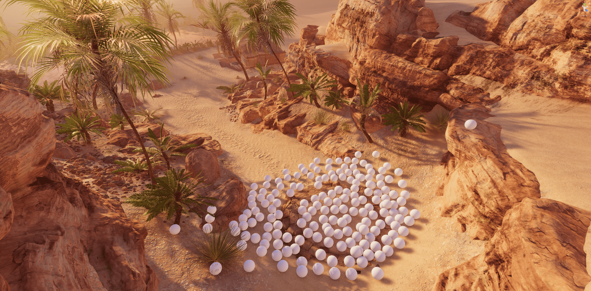
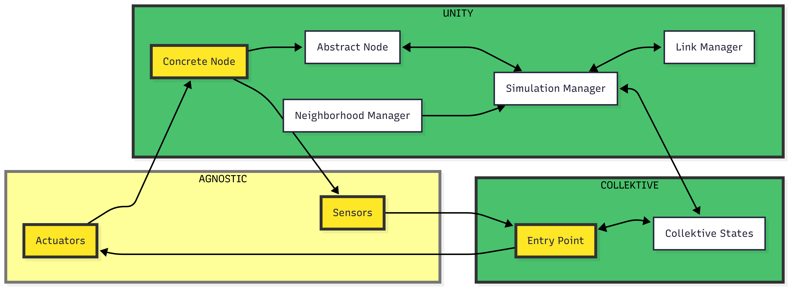
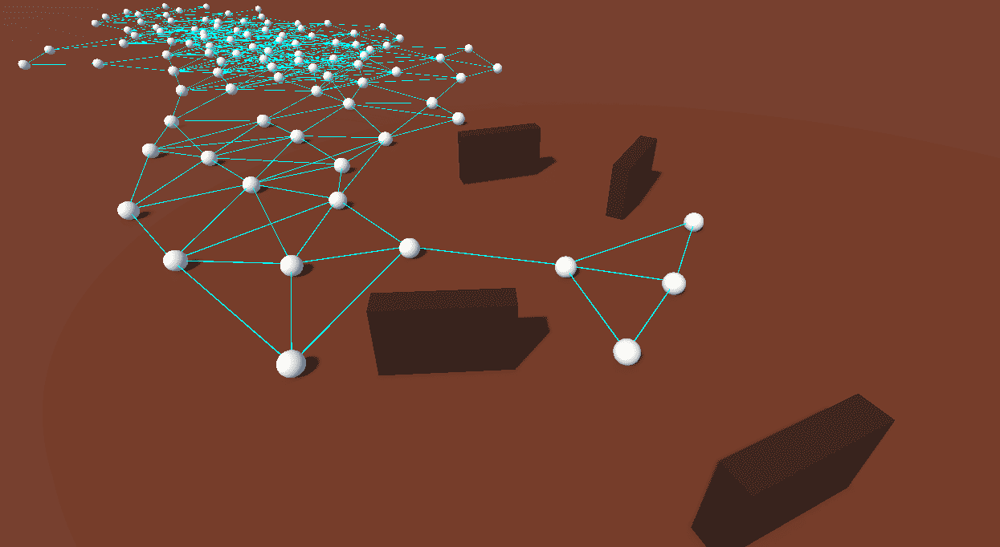
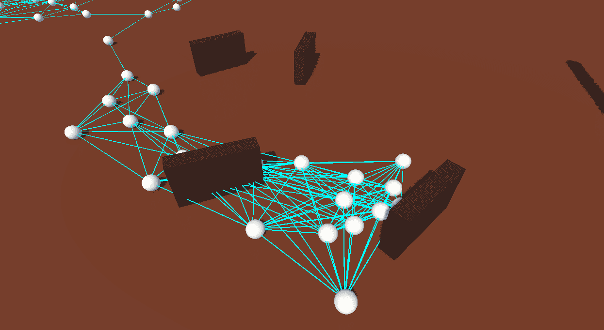
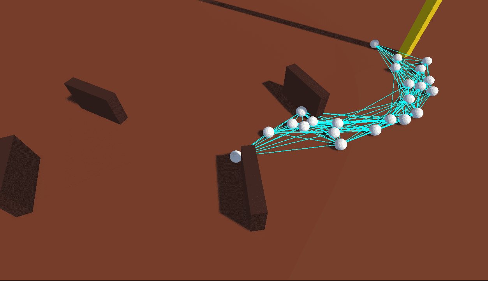
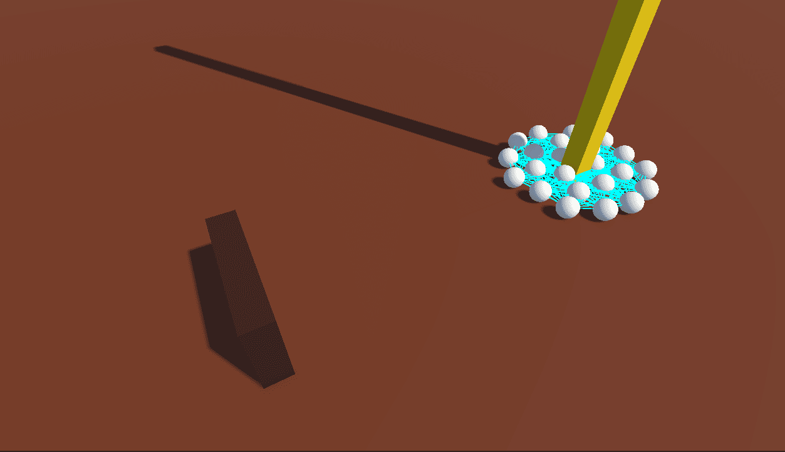

+++
title = "High-Fidelity Simulation of Aggregate Computing Systems with Collektivity"
outputs = ["Reveal"]
+++

## High-Fidelity Simulation of Aggregate Computing Systems
## with Collektivity

<br />

*Filippo Gurioli*, __*Martina Baiardi*__, *Angela Cortecchia*, and *Danilo Pianini*
<br />
<br /><small>
Department of Computer Science and Engineering <br/>
University of Bologna, Cesena, Italy
</small>

---

{}
{}

## Context: Collective Adaptive Systems

* Collective Adaptive Systems are made of many *situated* and *interacting* devices.

* Their behaviour emerges from *local interactions* under mobility, failures, and changing environments.

* Examples include robot swarms, sensor networks, and IoT applications.

{}
{}

<br />

{}
{}

---

{}
{}

## Context: Aggregate Programming

Aggregate Programming lets developers express *collective behaviour* instead of orchestrating every device.

* A program runs repeatedly on each device.
* Devices exchange messages with neighbours.
* The global behaviour is represented as a *computational field*.

In this paper, the aggregate runtime is *Collektive*, a Kotlin Multiplatform framework.

{}
{}

```kotlin
device round:
  read sensors
  read neighbour messages
  run aggregate program
  send messages
  apply actuators
```

{}
{}

---

## Motivation

Simulation is central to validating Collective Adaptive Systems, but there is a persistent trade-off:

{}
{}

### Lower fidelity

* Scales to large populations
* Supports parameter sweeps
* Easier to automate
* Simplifies physics and environment

{}
{}

### Higher fidelity

* More realistic physics
* Richer environments
* Better sensing and actuation models
* Harder to build from scratch

{}
{}

---

{}
{}

## Why Game Engines?

Game engines already provide capabilities that CAS simulators often need:

* real-time 3D rendering
* physics and collisions
* interactive scene authoring
* complex environments
* support for mixed reality and digital twins

The open question: can we run aggregate programs *inside* such an environment, not just visualize traces?

{}
{}



{}
{}

---

## Proposal: Collektivity

Collektivity integrates *Collektive* with the *Unity* game engine.

{}
{}

### Unity

* owns the world
* computes physics
* samples sensors
* maintains neighbourhoods
* applies actuator commands

{}
{}

### Collektive

* executes aggregate rounds
* stores device state
* manages neighbour messages
* computes collective behaviour
* returns actuator data

{}
{}

---

## Architecture



<small>
The yellow components are scenario-specific: concrete nodes, sensors, actuators, and the aggregate entry point.
</small>

---

## Requirements

{}
{}

### R1: Case-study agnostic

The integration layer must not hard-code a specific domain.

### R2: Bidirectional

Unity sends *sensor data* to Collektive; Collektive sends *actuation commands* back.

{}
{}

### R3: High performance

The bridge must be fast enough to support hundreds of simulated devices.

### Design consequence

Use a shared, platform-agnostic data model for sensors and actuators.

{}
{}

---

{}
{}

## Shared Data Model

Collektivity uses *Protocol Buffers* to define the data exchanged across Unity and Collektive.

* one schema
* generated C# bindings for Unity
* generated Kotlin bindings for Collektive
* explicit `Sensors` and `Actuators` messages

{}
{}

```protobuf
message Actuators {
  Vector3 targetPosition = 1;
}

message Sensors {
  double sourceIntensity = 1;
  Vector3 currentPosition = 2;
  repeated Vector3 obstacles = 3;
}
```

{}
{}

---

{}
{}

## Native Execution Through FFI

Unity and Collektive do not share the same runtime:

* Unity runs on a custom .NET environment.
* Collektive is Kotlin Multiplatform.
* Existing Collektive targets cannot simply run inside Unity.

The solution is to compile Collektive as a *native library* and invoke it from Unity through FFI.

{}
{}

```kotlin
interface Engine {
  fun step(id: Int, sensorData: Sensors): Actuators
  fun subscribe(node1: Int, node2: Int): Boolean
  fun unsubscribe(node1: Int, node2: Int): Boolean
  fun addNode(id: Int): Boolean
  fun removeNode(id: Int): Boolean
}
```

{}
{}

---

## Runtime Cycle

{}
{}

At every simulation tick:

1. Unity samples the world state.
2. Unity calls `step(id, sensors)`.
3. Collektive runs one aggregate round.
4. Collektive returns actuator commands.
5. Unity applies the commands.
6. Unity updates neighbourhood links.

{}
{}

This keeps the division of responsibilities clean:

* Unity owns embodiment and environment.
* Collektive owns distributed computation semantics.
* The schema owns cross-platform data exchange.

{}
{}

---

## Result: Communication Benchmark

The authors compared two bridge strategies on a 12-node prototype:

{}
{}

### Socket backend

* Unity and Collektive run as separate processes.
* Data crosses TCP sockets.
* More flexible, but expensive.

{}
{}

### Native backend

* Collektive is compiled as a native shared library.
* Unity invokes it through FFI.
* Much faster, so it was selected.

{}
{}

<br />

*Mean end-to-end socket execution was over 450x slower than native FFI; p99 slowdown was over 700x.*

---

{}
{}

## Result: Simple 3D Exemplar

The first exemplar deploys devices in a simple 3D arena with obstacles.

* Devices move toward a source of interest.
* They avoid nearby obstacles and other devices.
* They use distance-based neighbourhoods.
* Aggregate rounds run at *20Hz*.

The system reached 100 nodes on a desktop with a dedicated GPU.

{}
{}


<br/>



{}
{}

---



## Result: Richer Unity Environment

The same aggregate behaviour was tested in Unity's *Oasis* environment.

{}
{}

* Trees, rocks, bushes, and terrain become physical obstacles.
* The source is placed inside a tent across the arena.
* The scenario demonstrates the benefit of using an existing high-fidelity environment.

{}
{}

* 100 nodes were demonstrated.
* Real-time execution required the better equipped desktop.
* Rendering, geometry, and physics increase the simulation cost.

{}
{}

---

## What The Paper Shows

{}
{}

### Achieved

* Collektive can be executed from Unity.
* Unity can drive aggregate rounds.
* Sensors and actuators can be schema-driven.
* Native FFI makes the bridge practical.

{}
{}

### Still open

* More complex aggregate programs.
* Larger populations: 1,000 and 10,000 nodes.
* Entity Component System comparison.
* Portability to Unreal Engine or Godot.

{}
{}

---

## Conclusion

Collektivity is a toolchain for running *aggregate programs written in Collektive* on top of *Unity*.

It turns the game engine into a high-fidelity environment layer for Collective Adaptive Systems, while preserving the aggregate runtime as the place where distributed computation semantics live.

<br />

Source code and benchmark artifacts are publicly available:

<small>
https://github.com/pslab-unibo/collektivity <br/>
https://github.com/pslab-unibo/experiment-2026-coordination-collektive-unity-benchmark
</small>

### Thank you
